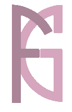

 

<h2 align="center">Hi there 👋, welcome on my GitHub !</h2>

    

Computer science engineering student at UTBM, I'm currently looking for a six-month internship in Data Science and AI from February to August 2027.

<h3>Data Science 📊</h3>

    I'm currently majoring Data Science. In this field, I have learned several libraries and algorithms such as :

    
    
    
    
    
    

<h3>Languages and Tools ⚒️</h3>

<h4>Languages</h4>

    
    
    
    
    

    
    
    
    
    

<h4>Databases<h4>

    
    
    
    

<h4>Framworks</h4>

    
    
    
    
    

    
    

<h4>Tools<h4>

    
    
    
    
    

<h4>Operating system</h4>

    
    

<h4>Architectures</h4>

- MVC *(Model, View, Controller)*
- REST *(Representational State Transfer)*
- RCSM *(Router, Controller, Service, Model)*
- TDD *(Test Driven Development)*
- CDM *(Conceptual Data Modeling)*
- UML *(Unified Modeling Language)*

<h3>Links & contact details</h3>

    
        LinkedIn:
        <a href="https://www.linkedin.com/in/- giuliana-godail-fabrizio-20639525b/">giuliana-godail-fabrizio</a>

    
        Mail:
        <a href="godailfabriziogiuliana@gmail.com">godailfabriziogiuliana@gmail.com</a>

    
        Portfolio:
        <a href="https://giuliana-fabrizio.github.io/Portfolio/#/">my portfolio</a>

